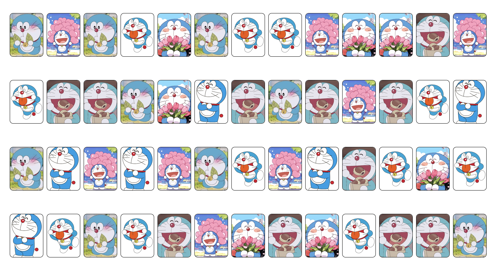

# Random Image Cards
This is a simple project that displays 52 cards, each showing a random image from a predefined set of images.

## 🔗 Live Demo of project
[click to view project](https://cartooncard.netlify.app/) 🚀

### ⚡ Features
- Displays 52 cards dynamically
- Each card gets a random image from the array
- Cards are injected into the DOM using innerHTML.

### 🛠️ Tech Stack
- HTML - Structure of the webpage
- CSS – Styling and layout of cards
- JavaScript – Random image generation logic 

### 📸 Demo  

