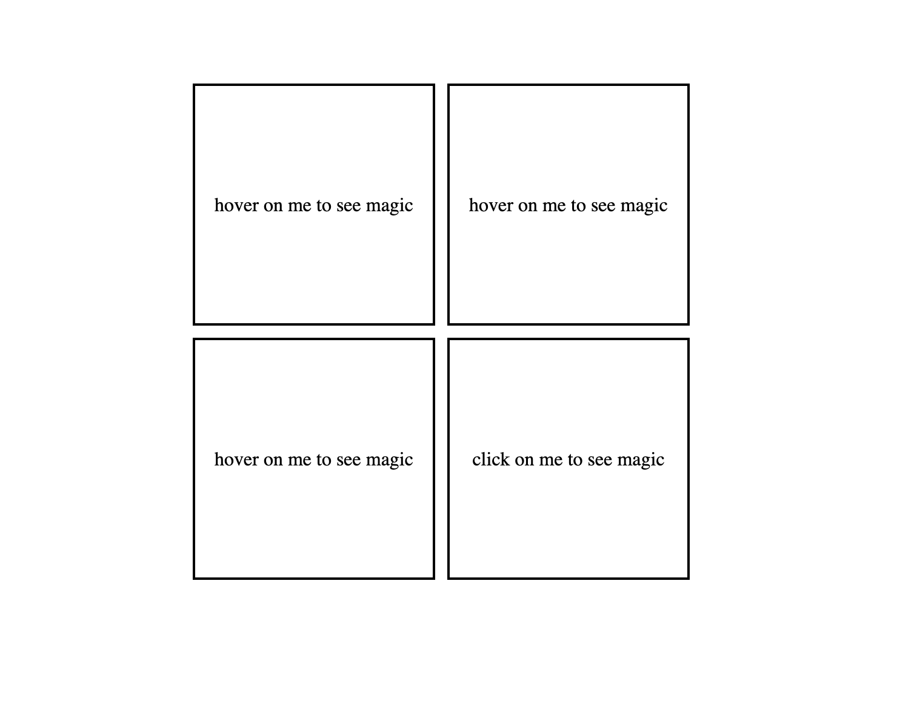
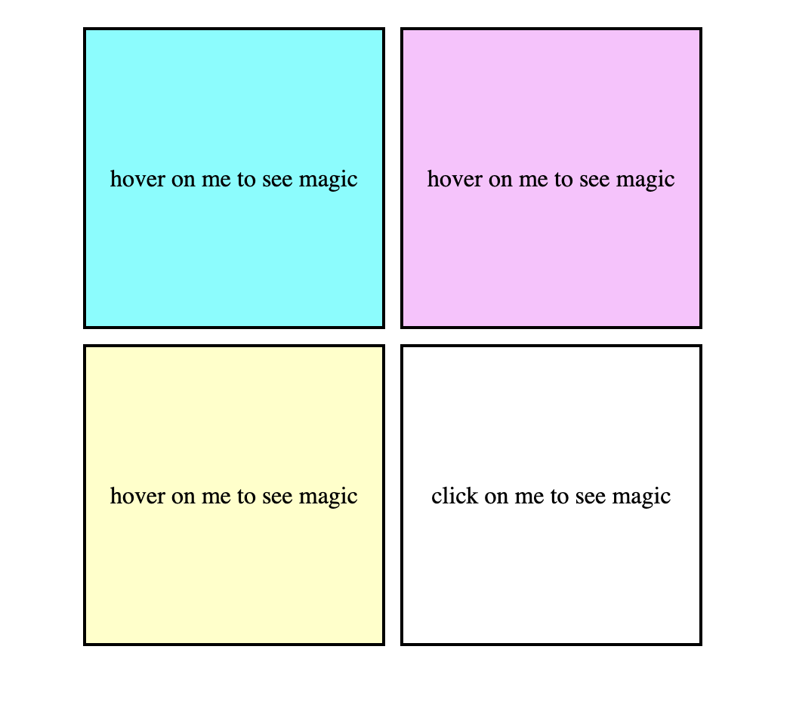
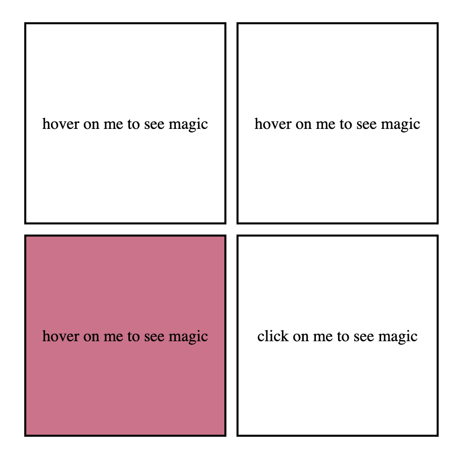
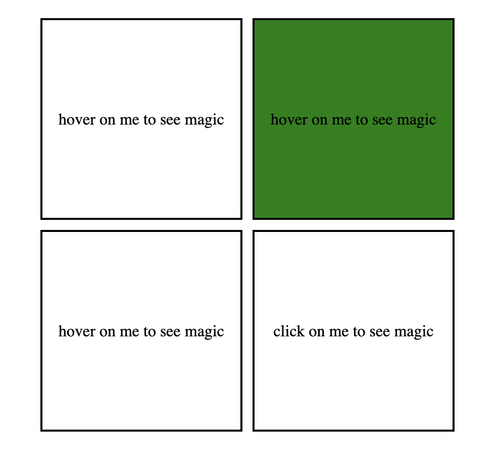
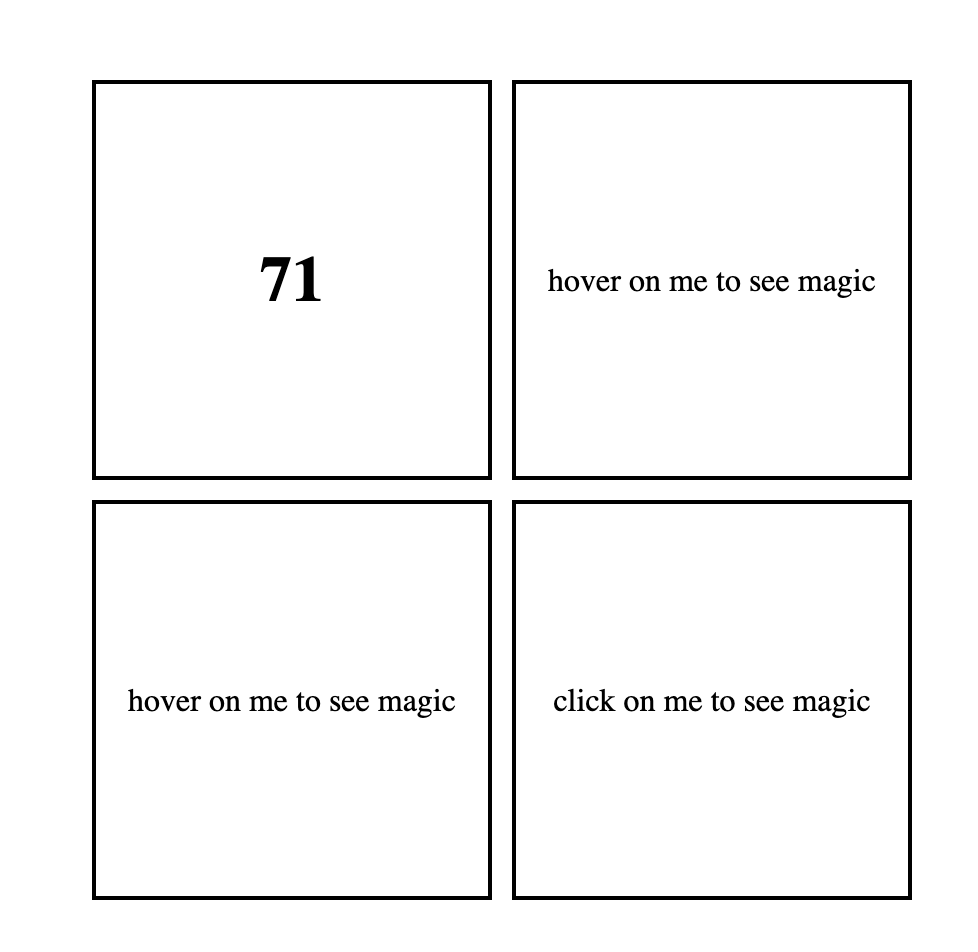

## 🔗 Live Demo of project 
[View Project](https://dulcet-biscotti-f6aa32.netlify.app/) 🚀

### 📸 Screenshot of the project

  

    
  

  

    
  

  

    
  

  

    
  

  

    
  

  

    
  

